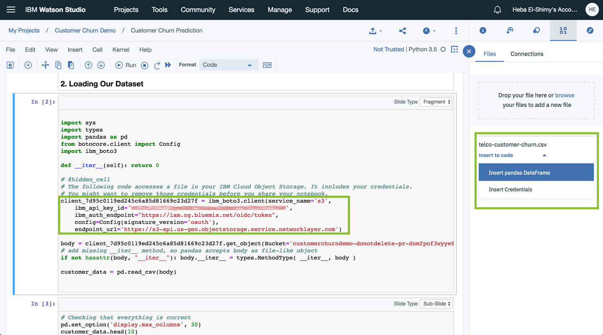

<!--Put badges at the very top -->
<!--change the repo -->
[](https://travis-ci.org/IBM/watson-banking-chatbot)
<!--Add a new Title and fill in the blanks -->
# Build a Customer Churn Predictor using Watson Studio and Jupyter Notebooks
In this Code Pattern, we use IBM Watson Studio to go through the whole data science pipeline to solve a business problem and predict customer churn using Telco customer churn dataset. Watson Studio is an interactive, collaborative, cloud-based environment where data scientists, developers, and others interested in data science can use tools (e.g., RStudio, Jupyter Notebooks, Spark, etc.) to collaborate, share, and gather insight from their data as well as build and deploy machine learning and deep learning models.

When the reader has completed this Code Pattern, they will understand how to:

* Use [Jupyter Notebooks](http://jupyter.org/) to load, visualize, and analyze data
* Run Notebooks in [IBM Watson Studio](https://dataplatform.ibm.com/)
* Load data from [IBM Cloud Object Storage](https://console.bluemix.net/catalog/services/cloud-object-storage)
* Build, test and compare different machine learning models using [Scikit-Learn](http://scikit-learn.org/)
* Deploy a selected machine learning model to production using Watson Studio
* Create a front-end application to interface with the client and start consuming your deployed model.

<!--Remember to dump an image in this path-->


## Flow
<!--Add new flow steps based on the architecture diagram-->
1. Understand the business problem.
2. Load the provided notebook into the Watson Studio platform.
3. [Telco customer churn data set](https://community.watsonanalytics.com/wp-content/uploads/2015/03/WA_Fn-UseC_-Telco-Customer-Churn.csv) is loaded into the Jupyter Notebook.
4. Decribe, analyze and visualize data in the notebook.
5. Preprocess the data, build machine learning models and test them..
6. Deploy a selected machine learning model into production.
7. Interact and consume your model using a frontend application.

<!--Update this section-->
## Included components
* [IBM Watson Studio](https://www.ibm.com/us-en/marketplace/data-science-experience): Analyze data using RStudio, Jupyter, and Python in a configured, collaborative environment that includes IBM value-adds, such as managed Spark.

<!--Update this section-->
## Featured technologies
Select components from [here](https://github.ibm.com/developer-journeys/journey-docs/tree/master/_content/dev#technologies), copy and paste the raw text for ease
* [Jupyter Notebooks](http://jupyter.org/): An open-source web application that allows you to create and share documents that contain live code, equations, visualizations and explanatory text.
* [Pandas](https://pandas.pydata.org/):  An open source library providing high-performance, easy-to-use data structures and data analysis tools for the Python programming language.
* [Seaborn](https://seaborn.pydata.org/): A Python data visualization library based on matplotlib. It provides a high-level interface for drawing attractive and informative statistical graphics.
* [Scikit-Learn](http://scikit-learn.org/): Machine Learning in Python. Simple and efficient tools for data mining and data analysis.
* [Watson Machine Learning Client](https://pypi.org/project/watson-machine-learning-client/): A library that allows to work with Watson Machine Learning service on [IBM Cloud](https://console.bluemix.net/catalog/services/machine-learning). Train, test and deploy your models as APIs for application development, share with colleagues using this python library.
* [NodeJS](https://nodejs.org/): A JavaScript runtime built on Chrome's V8 JavaScript engine, used for building full stack Javascript web applications.
* [ExpressJS](https://expressjs.com/): A minimal and flexible Node.js web application framework that provides a robust set of features for web and mobile applications.

<!--Update this section when the video is created-->
# Watch the Video
[](https://youtu.be/13Y_AI1s9k8)

# Steps
1. [Sign up for the Watson Studio](#1-sign-up-for-the-watson-studio)
2. [Create a new Project](#2-create-a-new-project)
3. [Upload the dataset](#3-upload-the-dataset)
4. [Import notebook to Watson Studio](#4-import-notebook-to-watson-studio)
5. [Import dataset into the notebook](#5-import-dataset-into-the-notebook)
6. [Follow the steps in the notebook](#6-follow-the-steps-in-the-notebook)
7. [Create Watson Machine Learning Service instance](#7-create-watson-machine-learning-service-instance)
8. [Deploy your model to the cloud](#8-deploy-your-model-to-the-cloud)
9. [Try out the model by using the frontend application](#9-try-out-the-model-by-using-the-frontend-application)

### 1. Sign up for the Watson Studio

Sign up for IBM's [Watson Studio](https://dataplatform.ibm.com/). By creating a project in Watson Studio a free tier Object Storage service will be created in your IBM Cloud account. Take note of your service names as you will need to select them in the following steps.

> Note: When creating your Object Storage service, select the Free storage type in order to avoid having to pay an upgrade fee.

### 2. Create a new Project

* On Watson Studio's Welcome Page select **New Project**.


* Choose the **Complete** option.


* Name your project, select the Cloud Object Storage service instance and click **Create**.


### 3. Upload the dataset

* Download the dataset we will use in this pattern from the following link: [https://community.watsonanalytics.com/wp-content/uploads/2015/03/WA_Fn-UseC_-Telco-Customer-Churn.csv](https://community.watsonanalytics.com/wp-content/uploads/2015/03/WA_Fn-UseC_-Telco-Customer-Churn.csv)

> Note: If you want a smooth flow when executing the code in the notebook, rename the downloaded dataset file to `telco-customer-churn.csv`.

* Drag and drop the dataset (csv) file you just downloaded to Watson Studio's dashboard to upload it to Cloud Object Storage.


* Don't change the page as to not interrupt the upload process, once it's done you should find the dataset under the **Data assets** category.


### 4. Import notebook to Watson Studio

* Create a **New Notebook**.


* Import the notebook found in this repository inside the notebook folder by copying and pasting this url in the relevant field `https://github.com/IBM/customer-churn-prediction/blob/master/notebooks/customer-churn-prediction.ipynb`. Give a name to the notebook and select a runtime environment, then click **Create**.


### 5. Import dataset into the notebook

To make the dataset available in the notebook, we need to refer to where it lives. Watson Studio automatically generates a connection to your Cloud Object Storage instance and gives access to your data.

* Click the data icon in the toolbar, and in the right sidebar, you should find the previously uploaded dataset. Click on **Insert to code**, you will see 2 options, first option **Insert Pandas Dataframe** will autogenerate the code you need to grab that specific dataset from where it lives on Cloud Object Storage. The second option, **Insert Credentials** is only to paste in your Cloud Object Storage instance credentials.

* In our case, if you're following along with the steps in the notebook, you should have a cell with the code needed to give you access to your instance of Cloud Object Storage and load the dataset into a Pandas Dataframe. You just need to replace the asterisks in the following block of code found in the notebook with your credentials (you can find those by clicking on Insert Credentials):

```
client_7d95c0119ed245c6a85d81669c23d27f = ibm_boto3.client(service_name='s3',
    ibm_api_key_id='********',
    ibm_auth_endpoint="*********",
    config=Config(signature_version='oauth'),
    endpoint_url='*********')

body = client_7d95c0119ed245c6a85d81669c23d27f.get_object(Bucket='**********',Key='telco-customer-churn.csv')['Body']

```



### 6. Follow the steps in the notebook

The steps should allow you to understand the dataset, analyze and visualize it. You will then go through the preprocessing and feature engineering processes to make the data suitable for modelling. Finally, you will build some machine learning models and test them to compare their performances.

### 7. Create Watson Machine Learning Service instance

When you reach the part in the notebook where we start the deployment of a selected model, make sure you have a running instance of **Watson Machine Learning Service**. If you don't have one already, follow these steps to create one.

* From [IBM Cloud Catalog](https://console.bluemix.net/catalog/), under the Watson category, select **Machine Learning**.


* Keep the setting as they are and click **Create**.


* Once the service instance is created, navigate to **Service credentials**, view credentials and make note of them.

> Note: If you can't see any credentials available, you can create a **New credential**.


* In the notebook availble with this pattern, there is a cell with the WML credentials available, you just need to replace the code inside with your credentials.


### 8. Deploy your model to the cloud

Follow the steps in the notebook to deploy your model on the cloud.

> Note: the url generated as an endpoint for scoring using your model will be different than the one in this notebook, please use your generated url to test your own model.

### 9. Try out the model by using the frontend application.

Go to [https://customer-churn-webapp.mybluemix.net/](https://customer-churn-webapp.mybluemix.net/) to try out the model. You can find the details of the frontend application in the `frontend` folder of this repo.

<!--Add a section that explains to the reader what typical output looks like, include screenshots -->

# Sample output


<!--Include any troubleshooting tips (driver issues, etc)-->


<!--Include any relevant links-->

# Links
* [Demo on Youtube](https://youtu.be/13Y_AI1s9k8)

<!-- pick the relevant ones from below -->
# Learn more
* **Artificial Intelligence Code Patterns**: Enjoyed this Code Pattern? Check out our other [AI Code Patterns](https://developer.ibm.com/code/technologies/artificial-intelligence/).
* **Data Analytics Code Patterns**: Enjoyed this Code Pattern? Check out our other [Data Analytics Code Patterns](https://developer.ibm.com/code/technologies/data-science/)
* **AI and Data Code Pattern Playlist**: Bookmark our [playlist](https://www.youtube.com/playlist?list=PLzUbsvIyrNfknNewObx5N7uGZ5FKH0Fde) with all of our Code Pattern videos
* **With Watson**: Want to take your Watson app to the next level? Looking to utilize Watson Brand assets? [Join the With Watson program](https://www.ibm.com/watson/with-watson/) to leverage exclusive brand, marketing, and tech resources to amplify and accelerate your Watson embedded commercial solution.
* **IBM Watson Studio**: Master the art of data science with IBM's [Watson Studio](https://datascience.ibm.com/)
* **PowerAI**: Get started or get scaling, faster, with a software distribution for machine learning running on the Enterprise Platform for AI: [IBM Power Systems](https://www.ibm.com/ms-en/marketplace/deep-learning-platform)
* **Spark on IBM Cloud**: Need a Spark cluster? Create up to 30 Spark executors on IBM Cloud with our [Spark service](https://console.bluemix.net/catalog/services/apache-spark)

<!--keep this-->

# License
[Apache 2.0](LICENSE)