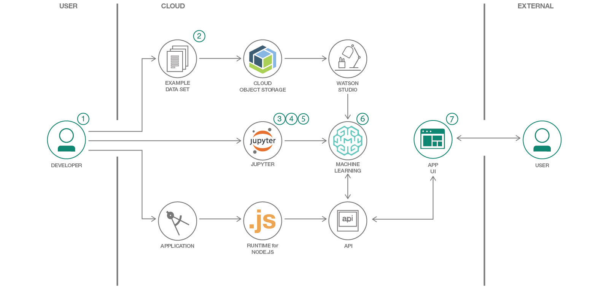

# WARNING: This repository is no longer maintained :warning:

> This repository will not be updated. The repository will be kept available in read-only mode. For an alternate, please see https://github.com/IBM/predictive-model-on-watson-ml or the on-premise Cloud Pak for Data version of this pattern: https://github.com/IBM/telco-customer-churn-on-icp4d

# Predict Customer Churn using Watson Studio and Jupyter Notebooks

In this Code Pattern, we use IBM Watson Studio to go through the whole data science pipeline to solve a business problem and predict customer churn using a Telco customer churn dataset. Watson Studio is an interactive, collaborative, cloud-based environment where data scientists, developers, and others interested in data science can use tools (e.g., RStudio, Jupyter Notebooks, Spark, etc.) to collaborate, share, and gather insight from their data as well as build and deploy machine learning and deep learning models.

When the reader has completed this Code Pattern, they will understand how to:

* Use [Jupyter Notebooks](https://jupyter.org/) to load, visualize, and analyze data
* Run Notebooks in [IBM Watson Studio](https://dataplatform.cloud.ibm.com/)
* Load data from [IBM Cloud Object Storage](https://cloud.ibm.com/catalog/services/cloud-object-storage)
* Build, test and compare different machine learning models using [Scikit-Learn](https://scikit-learn.org/)
* Deploy a selected machine learning model to production using Watson Studio
* Create a front-end application to interface with the client and start consuming your deployed model.



## Flow

1. Understand the business problem.
2. Load the provided notebook into the Watson Studio platform.
3. [Telco customer churn data set](https://community.watsonanalytics.com/wp-content/uploads/2015/03/WA_Fn-UseC_-Telco-Customer-Churn.csv) is loaded into the Jupyter Notebook.
4. Describe, analyze and visualize data in the notebook.
5. Preprocess the data, build machine learning models and test them.
6. Deploy a selected machine learning model into production.
7. Interact and consume your model using a frontend application.

## Included components

* [IBM Watson Studio](https://www.ibm.com/cloud/watson-studio): Analyze data using RStudio, Jupyter, and Python in a configured, collaborative environment that includes IBM value-adds, such as managed Spark.
* [IBM Cloud Foundry](https://cloud.ibm.com/dashboard/cloudfoundry/overview): Deploy and run your applications without managing servers or clusters. Cloud Foundry automatically transforms source code into containers, scales them on demand, and manages user access and capacity.

## Featured technologies

* [Jupyter Notebooks](https://jupyter.org/): An open-source web application that allows you to create and share documents that contain live code, equations, visualizations, and explanatory text.
* [Pandas](https://pandas.pydata.org/):  An open source library providing high-performance, easy-to-use data structures and data analysis tools for the Python programming language.
* [Seaborn](https://seaborn.pydata.org/): A Python data visualization library based on matplotlib. It provides a high-level interface for drawing attractive and informative statistical graphics.
* [Scikit-Learn](https://scikit-learn.org/): Machine Learning in Python. Simple and efficient tools for data mining and data analysis.
* [Watson Machine Learning Client](https://pypi.org/project/watson-machine-learning-client/): A library that allows working with Watson Machine Learning service on [IBM Cloud](https://cloud.ibm.com/catalog/services/machine-learning). Train, test and deploy your models as APIs for application development, share with colleagues using this python library.
* [NodeJS](https://nodejs.org/): A JavaScript runtime built on Chrome's V8 JavaScript engine, used for building full stack Javascript web applications.
* [ExpressJS](https://expressjs.com/): A minimal and flexible Node.js web application framework that provides a robust set of features for web and mobile applications.

# Watch the Video

[](https://youtu.be/qchkktwMA6U)

# Steps

1. [Sign up for Watson Studio](#1-sign-up-for-watson-studio)
2. [Create a new Project](#2-create-a-new-project)
3. [Upload the dataset](#3-upload-the-dataset)
4. [Import notebook to Watson Studio](#4-import-notebook-to-watson-studio)
5. [Import dataset into the notebook](#5-import-dataset-into-the-notebook)
6. [Create Watson Machine Learning Service instance](#6-create-watson-machine-learning-service-instance)
7. [Follow the steps in the notebook](#7-follow-the-steps-in-the-notebook)
8. [Either Deploy to IBM Cloud or Deploy locally](#8-either-deploy-to-ibm-cloud-or-deploy-locally)

    8a. [Deploy to IBM Cloud](#8a-deploy-to-ibm-cloud)

    8b. [Deploy locally](#8b-deploy-locally)

### 1. Sign up for Watson Studio

Sign up for IBM's [Watson Studio](https://dataplatform.cloud.ibm.com/). By creating a project in Watson Studio a free tier Object Storage service will be created in your IBM Cloud account. Take note of your service names as you will need to select them in the following steps.

> Note: When creating your Object Storage service, select the Free storage type to avoid having to pay an upgrade fee.

### 2. Create a new Project

> Note: By creating a project in Watson Studio a free tier `Object Storage` service will be created in your IBM Cloud account. Take note of your service names as you will need to select them in the following steps.

* On Watson Studio's Welcome Page select `New Project`.


* Choose the `Data Science` option and click `Create Project`.


* Name your project, select the Cloud Object Storage service instance and click `Create`


### 3. Upload the dataset

* Download the dataset we will use in this pattern from the following link: [https://community.watsonanalytics.com/wp-content/uploads/2015/03/WA_Fn-UseC_-Telco-Customer-Churn.csv](https://community.watsonanalytics.com/wp-content/uploads/2015/03/WA_Fn-UseC_-Telco-Customer-Churn.csv)


* Drag and drop the dataset (`csv`) file you just downloaded to Watson Studio's dashboard to upload it to Cloud Object Storage.


### 4. Import notebook to Watson Studio

* Create a **New Notebook**.


* Import the notebook found in this repository inside the notebook folder by copying and pasting this URL in the relevant field `https://raw.githubusercontent.com/IBM/customer-churn-prediction/master/notebooks/customer-churn-prediction.ipynb`

* Give a name to the notebook and select a `Python 3.5` runtime environment, then click `Create`.


### 5. Import dataset into the notebook

To make the dataset available in the notebook, we need to refer to where it lives. Watson Studio automatically generates a connection to your Cloud Object Storage instance and gives access to your data.

* Click in the cell below `2. Loading Our Dataset`
* Then go to the Files section to the right of the notebook and click `Insert to code` for the data you have uploaded. Choose `Insert pandas DataFrame`.

### 6. Create Watson Machine Learning Service instance


* From [IBM Cloud Catalog](https://cloud.ibm.com/catalog/), under the Watson category, select `Machine Learning` or use the Search bar to find `Machine Learning`.


* Keep the setting as they are and click `Create`.


* Once the service instance is created, navigate to the `Service credentials` tab on the left, view credentials and make a note of them.

> Note: If you can't see any credentials available, you can create a `New credential`.


* In the notebook available with this pattern, there is a cell with the WML credentials available after `14. ROC Curve and models comparisons`. You will need to replace the code inside with your credentials.


* Keep this tab open, or copy the credentials to a file to use later if you deploy the web app.

### 7. Follow the steps in the notebook

The steps should allow you to understand the dataset, analyze and visualize it. You will then go through the preprocessing and feature engineering processes to make the data suitable for modeling. Finally, you will build some machine learning models and test them to compare their performances.

### 8. Either Deploy to IBM Cloud or Deploy locally

#### 8a. Deploy to IBM Cloud

Click on the following button to clone the repo for this frontend app and create a toolchain to start deploying the app from there.

[](https://cloud.ibm.com/devops/setup/deploy?repository=https://github.com/IBM/customer-churn-prediction)

* Under `IBM Cloud API Key:` choose `Create+`, and then click on ``Deploy``.

To monitor the deployment, in Toolchains click on `Delivery Pipeline`  and view the logs while the apps are being deployed.

* Once the app has deployed, Click on `Runtime` on the menu and navigate to the `Environment variables` tab.


* Update the 5 environment variables with the `WML_INSTANCE_NAME`, `USERNAME`, `PASSWORD`, `INSTANCE_ID`, and `URL`, that you saved at the end of [Create Watson Machine Learning Service instance](#6-create-watson-machine-learning-service-instance). Add the `MODEL_URL` that you created in the Notebook as the variable `scoring_endpoint`.
The app will automatically restart and be ready for use.

### 8b. Deploy locally

For developing the UI locally and testing it:

* `cd frontend/`

* Create a `.env` file in frontend folder (frontend/.env) to hold your credentials.

`cp env.example .env `

For our purposes here, our `.env` file will look like the following:

```
WML_INSTANCE_NAME=**Enter with your Watson Machine Learning service instance name**
USERNAME=**Enter your WML username found in credentials**
PASSWORD=**Enter your WML password found in credentials**
INSTANCE_ID=**Enter your WML instance_id found in credentials**
URL=**Enter your WML url found in credentials**
MODEL_URL=**Change with your model URL after deploying it to the cloud as in step 8**

```
* Copy the variable for the .env file using the variables obtained at the end of [Create Watson Machine Learning Service instance](#6-create-watson-machine-learning-service-instance). Add the `MODEL_URL` that you created in the Notebook.

* Run the application.

```
cd frontend/
npm install
npm start
```

You can view the application in any browser by navigating to [http://localhost:3000](http://localhost:3000). Feel free to test it out.

# Sample output

* Using Postman:


* Using the UI app:


# Links
* [Demo video on Youtube](https://youtu.be/qchkktwMA6U)
* [Read more about CRISPDM](https://www.ibm.com/support/knowledgecenter/en/SS3RA7_15.0.0/com.ibm.spss.crispdm.help/crisp_overview.htm)

# Learn more
* **Artificial Intelligence Code Patterns**: Enjoyed this Code Pattern? Check out our other [AI Code Patterns](https://developer.ibm.com/technologies/artificial-intelligence/).
* **Data Analytics Code Patterns**: Enjoyed this Code Pattern? Check out our other [Data Analytics Code Patterns](https://developer.ibm.com/technologies/data-science/)
* **AI and Data Code Pattern Playlist**: Bookmark our [playlist](https://www.youtube.com/playlist?list=PLzUbsvIyrNfknNewObx5N7uGZ5FKH0Fde) with all of our Code Pattern videos
* **With Watson**: Want to take your Watson app to the next level? Looking to utilize Watson Brand assets? [Join the With Watson program](https://www.ibm.com/watson/with-watson/) to leverage exclusive brand, marketing, and tech resources to amplify and accelerate your Watson embedded commercial solution.
* **IBM Watson Studio**: Master the art of data science with IBM's [Watson Studio](https://www.ibm.com/cloud/watson-studio)

# License
This code pattern is licensed under the Apache Software License, Version 2.  Separate third party code objects invoked within this code pattern are licensed by their respective providers pursuant to their own separate licenses. Contributions are subject to the [Developer Certificate of Origin, Version 1.1 (DCO)](https://developercertificate.org/) and the [Apache Software License, Version 2](https://www.apache.org/licenses/LICENSE-2.0.txt).

[Apache Software License (ASL) FAQ](https://www.apache.org/foundation/license-faq.html#WhatDoesItMEAN)
